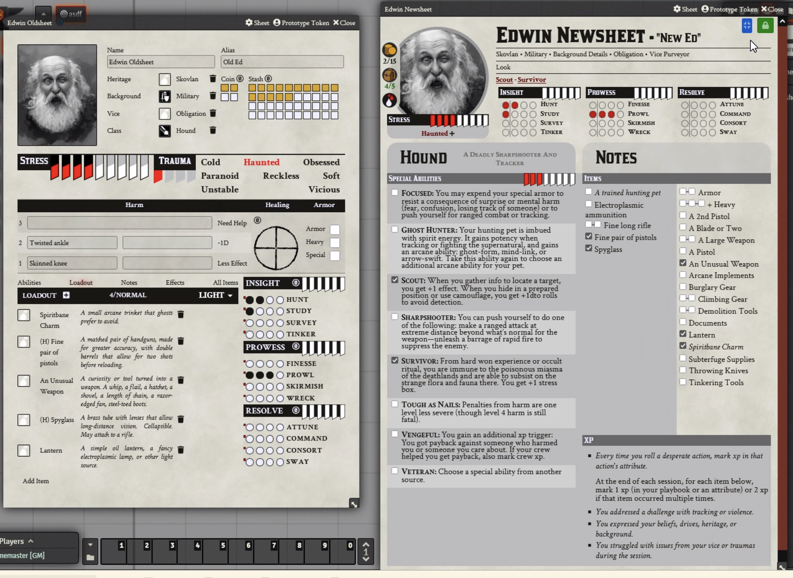
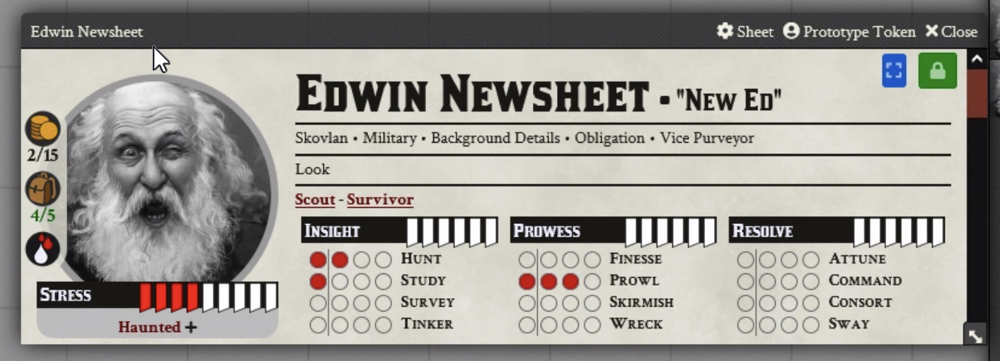
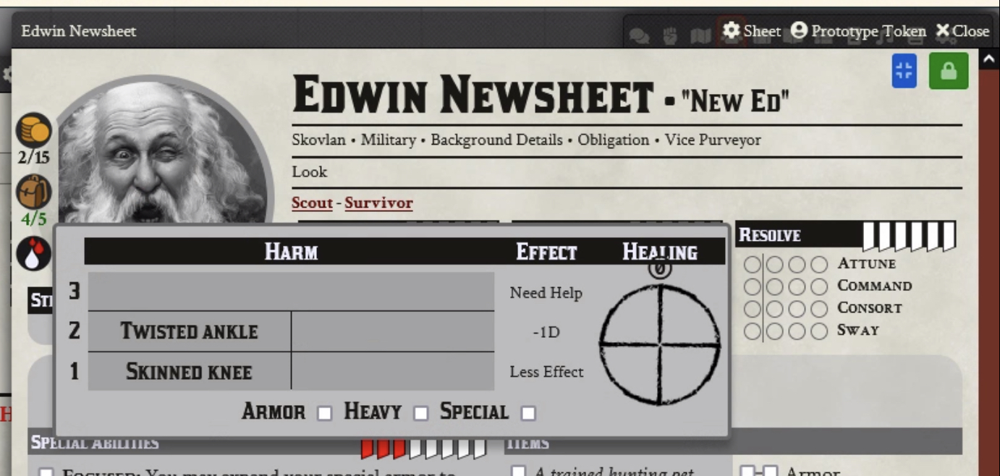
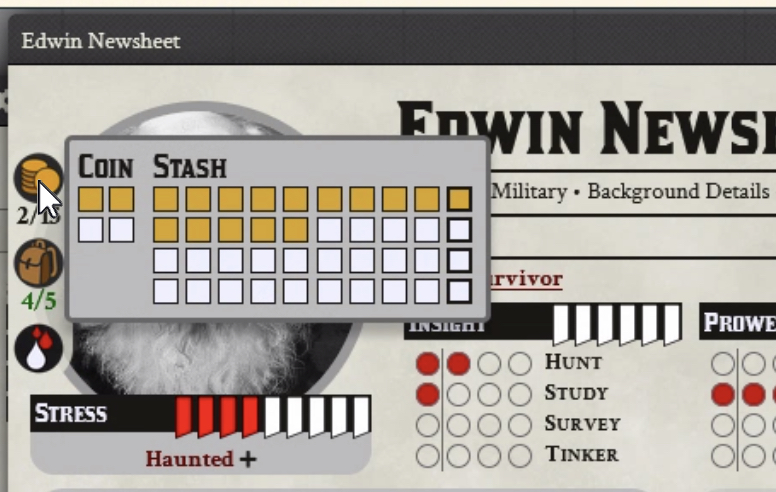

## Introduction
This module is a replacement for the default character sheets in Megastruktur's Blades in the Dark system for Foundry VTT.

Old sheets on the left, this module's sheet on the right.

## Using this sheet
This sheet should *mostly* work with data from the original sheets. Some information, such as the acquaintances section, will be missing until added manually.
To change playbooks, just drag/drop a class from the Class compendium onto the sheet. **THIS WILL OVERWRITE ABILITIES, SKILL RATINGS, AND LOADOUT ITEMS** Seriously. It automatically resets a bunch of stuff.

I have plans to add a confirmation/check to see if you want to save anything, but it's not in yet.

Dropping a playbook onto your sheet will set the default ability scores, add all available playbook abilities, and playbook items, as well as creating a list of acquaintances.

Items' equipped status is considered ephemeral (since it changes from score to score) and for the sake of code simplicity, is not synced between the original sheets and these sheets. Basically, if you have items added to your character on the original sheets, they will show up here as extra copies of that item. You can enter edit mode and right-click to delete the copies if needed.

**Edit mode** - The lock button in the top right corner toggles sheet editability. When editing is unlocked, you can right-click and delete custom items/abilities that you've added (but not playbook default or generic items/abilities). You can also edit biography info. This info (Background, Heritage, etc.) is taken from dropped items as in the original sheet, but you can also type into these fields, and this entered text will override the owned item values.

**Mini mode** - The blue button in the top right corner will toggle the sheet between full view and a mini mode that is suitable for most play needs, showing a list of owned abilities, biographical info, your skill values, etc. 

**Harm, Coin, Load** - These buttons next to the character portrait will open popups for making changes.

**General**
* Like the original sheet, clicking a skill or attribute will trigger a roll. 
* Clicking XP/Stress markers will mark up to the clicked pip. Click an already-red pip to deselect it (so clicking the "3" pip when 3 are already lit up will drop the value to 2. Just try it.)
* In edit mode, you can click the + next to "Items" or "Abilities" to add a new entry. Create one from scratch, or choose from a list of items that exist in the world/compendia.
* Theoretically, homebrew classes should work within reason. Settings checkboxes *should* dictate where the sheets pull their info from. The sheet will always try to display available abilities and items for a given class by matching the class name to an item or ability's "class" field. This has not been tested almost at all.
* Click the icon next to an acquaintance to specify a relationship, friend, rival, or neutral. Drag/drop NPCs onto the sheet to add them to your acquaintances.
* A debug icon at the bottom left of the sheet will let you see any Foundry Items owned by the current character.
* The Notes tab text area can take Markdown in edit mode, and will render it in lock mode.

##TODO:
* Add per-character clocks to the sheet (pending a PR on the bitd system)
* Redo the rest of the Blades sheets. Probably crew next.

##Changelog
Did the thing.
