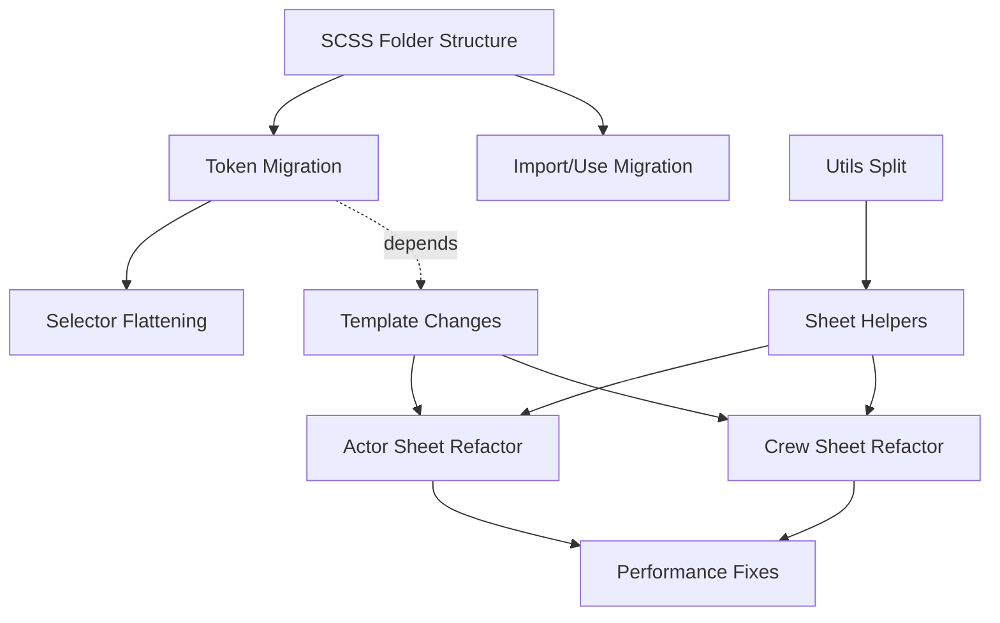

# Branch Restructuring Plan

**Branch:** `feature/alt-crew-sheet`  
**Commits:** 240 (relative to `upstream/master`)  
**Files Changed:** 121  
**Net Change:** +20,888 / -6,457 lines  
**Created:** 2025-12-31  

---

## Executive Summary

This branch has grown significantly beyond its original purpose (alternate crew sheet) into a comprehensive restructuring and refactoring of the codebase. The work includes:

- **SCSS Architecture Overhaul** - Token-driven design, module migration, folder restructuring
- **JavaScript Modularization** - Utils split, sheet helpers, clock/clock handler consolidation
- **Performance Improvements** - Render optimization, update batching, profiling infrastructure
- **Feature Additions** - Crew sheet enhancements, dockable sections, compendium tooltips
- **Bug Fixes** - Various UI, clock, and item handling fixes

> [!IMPORTANT]
> **Recommendation:** Due to the high degree of interdependency between changes, a **clean splitting strategy is not feasible**. The recommended approach is to **squash/rebase into logical commits** and submit as a single coordinated PR or a small sequence of tightly-coupled PRs.

---

## Branch Anatomy

### Commit Timeline (Earliest → Latest)

| Phase | Commits | Description | Quality |
|-------|---------|-------------|---------|
| 1-14 | `2de68aa` → `e79f437` | Initial crew sheet work, experiments | ⚠️ WIP/messy |
| 15-40 | `6262599` → `9d757bd` | SCSS cleanup, Firefox fixes, styling | 🔸 Mixed |
| 41-80 | `b4368a7` → `6664fd9` | Crew features, refactoring begins | ✅ Organized |
| 81-140 | `f90d6f0` → `c572330` | Heavy JS refactoring, modularization | ✅ Well-structured |
| 141-200 | `0a71433` → `02a3898` | SCSS token migration, flatten nests | ✅ Methodical |
| 201-240 | `db9e2ed` → HEAD | Final SCSS refactor, polish | ✅ Clean |

### File Hotspots (Most Modified)

| File | Commits | Primary Area |
|------|---------|--------------|
| `styles/css/bitd-alt.css` | 87 | Build output |
| `blades-alternate-actor-sheet.js` | 48 | Core sheet logic |
| `import/crew-sheet.scss` | 43 | Crew styling |
| `utils.js` | 41 | Shared utilities |
| `import/character-sheet.scss` | 38 | Character styling |
| `templates/crew-sheet.html` | 36 | Crew template |
| `templates/actor-sheet.html` | 27 | Actor template |

---

## Dependency Analysis

### Why Clean Splitting Is Difficult

1. **SCSS ↔ Templates Coupling**  
   - SCSS changes require matching template class names
   - Can't split styling from templates without breaking builds

2. **Utils ↔ Sheet JS Coupling**  
   - `utils.js` refactoring affects both actor and crew sheets
   - Module splits depend on shared helper functions

3. **Feature ↔ Refactor Interleaving**  
   - Features (e.g., dockable sections) were built alongside refactors
   - Performance fixes depend on refactored code structure

4. **Sequential Dependencies**  
   - Later SCSS tokenization depends on earlier folder restructuring
   - Clock consolidation depends on hook handler refactoring



---

## Recommended Restructuring Approach

### Option A: Squash & Rebase (Recommended)

Create 5-8 logical commits from the 240 commits via interactive rebase.

#### Proposed Logical Commits

| # | Commit Title | Content |
|---|--------------|---------|
| 1 | `build: Add Sass build infrastructure` | `package.json` scripts, stylelint, initial SCSS sources |
| 2 | `feat: Crew sheet alternate implementation` | Crew sheet templates, basic styling, notes tab |
| 3 | `refactor: SCSS architecture overhaul` | Folder structure, tokens, `@use/@forward` migration |
| 4 | `refactor: JavaScript modularization` | Utils split, sheet helpers, clock consolidation |
| 5 | `perf: Render optimization and batching` | Update suppression, profiling, render guards |
| 6 | `feat: UI enhancements` | Dockable sections, tooltips, identity fields |
| 7 | `fix: Bug fixes and polish` | Clock fixes, item handling, standing toggles |
| 8 | `docs: Documentation updates` | REFACTOR_PLAN.md, SCSS_REFACTOR.md, metrics |

#### Execution Steps

```bash
# Create backup branch
git checkout feature/alt-crew-sheet
git checkout -b feature/alt-crew-sheet-backup

# Start interactive rebase
git checkout feature/alt-crew-sheet
git rebase -i upstream/master

# In the editor:
# - Mark first commit in each logical group as "pick"
# - Mark subsequent commits as "fixup" or "squash"
# - Reorder commits into logical groups
```

---

### Option B: Partial Split (High Effort)

If upstream prefers smaller PRs, attempt a partial split. This requires careful cherry-picking and conflict resolution.

#### PR Sequence (if splitting)

| Order | PR Name | Dependencies | Files |
|-------|---------|--------------|-------|
| 1 | SCSS Build Infrastructure | None | `package.json`, `package-lock.json`, `.stylelintrc` |
| 2 | SCSS Restructuring | PR #1 | `styles/scss/**` minus component bodies |
| 3 | Crew Sheet Feature | PR #2 | `templates/crew-sheet.html`, crew JS, crew SCSS |
| 4 | Utils Modularization | None | `scripts/utils/**/*.js` |
| 5 | Sheet JS Refactoring | PR #4 | Actor/Crew sheet JS files |
| 6 | Performance Fixes | PR #5 | Hook modifications, render guards |

> [!WARNING]
> This approach requires significant effort (8-16 hours) to:
> - Cherry-pick commits into separate branches
> - Resolve merge conflicts between branches
> - Re-test each branch independently
> - Coordinate merge order

---

## Sub-Agent Task Delegation

If delegating to sub-agents, use these task definitions:

### Task 1: Squash Planning

```markdown
**Objective:** Analyze the 240 commits and create a squash plan.

**Inputs:**
- Branch: feature/alt-crew-sheet
- Base: upstream/master

**Steps:**
1. Run `git log --oneline upstream/master..HEAD > commits.txt`
2. Group commits into 5-8 logical categories
3. For each category, list commit hashes and proposed squash commit message
4. Output: `SQUASH_PLAN.md` with commit groupings

**Exit Condition:** SQUASH_PLAN.md created and reviewed
```

### Task 2: Interactive Rebase Execution

```markdown
**Objective:** Execute the interactive rebase according to SQUASH_PLAN.md

**Inputs:**
- SQUASH_PLAN.md
- Backup branch created

**Steps:**
1. Verify backup branch exists: `git branch | grep backup`
2. Run `git rebase -i upstream/master`
3. Apply squash plan in editor
4. Resolve conflicts using 3-way merge, preferring HEAD
5. Verify build: `npm run build:css && npm run lint`
6. Compare output: `git diff upstream/master --stat`

**Exit Condition:** Rebase complete, build passes, backup preserved
```

### Task 3: Post-Rebase Verification

```markdown
**Objective:** Verify the rebased branch against the original

**Inputs:**
- Rebased branch
- Backup branch

**Steps:**
1. Build both branches and compare CSS output:
   ```bash
   git checkout feature/alt-crew-sheet-backup
   npm run build:css
   cp styles/css/bitd-alt.css /tmp/backup.css
   
   git checkout feature/alt-crew-sheet
   npm run build:css
   diff styles/css/bitd-alt.css /tmp/backup.css
   ```
2. Run lint: `npm run lint:css`
3. Manual spot-check: Load character and crew sheets in Foundry

**Exit Condition:** CSS output identical, lint passes, visual check passes
```

---

## Verification Plan

### Automated Checks

```bash
# Build
npm run build:css

# Lint
npm run lint:css

# Metrics (if available)
npm run metrics:styles
npm run metrics:js

# Git verification
git log --oneline upstream/master..HEAD | wc -l  # Should be 5-8
```

### Manual Verification

Load in Foundry VTT and verify:
- [ ] Character sheet renders correctly
- [ ] Crew sheet renders correctly
- [ ] Clocks work (increment/decrement)
- [ ] Dockable sections toggle
- [ ] Item filtering works
- [ ] Acquaintance standing toggles work

---

## Risk Register

| Risk | Likelihood | Impact | Mitigation |
|------|------------|--------|------------|
| Rebase conflicts | High | Medium | Create backup branch first; use 3-way merge |
| Lost commits | Low | High | Preserve backup branch; verify `git diff` is empty |
| Build failures | Medium | Low | Test build after each squash group |
| Visual regression | Medium | Medium | Compare CSS output byte-for-byte |

---

## Decision Points for User

1. **Squash vs Split?**  
   Recommend squash (Option A) unless upstream explicitly requests separate PRs.

2. **Communication with Upstream**  
   Draft a PR description explaining the scope before submitting?

3. **Backup Retention**  
   Keep backup branch for how long after successful merge?

4. **Documentation Updates**  
   Include docs changes in same PR or separate?

---

## Appendix: Commit Categories

### SCSS/Styling (30 explicit + many implicit)
```
02a3898 Tokenize SCSS colors
db9e2ed Tokenize SCSS spacing
c3bd08f Forward flexbox layout
...
```

### Refactoring (43 commits)
```
3628e5f Refactor sheet sections into dock-section partial
a65d74d Refactor item sections into reusable partial
194f37f Refactor actor getData into phased view model pipeline
...
```

### Performance/Fixes (44 commits)
```
1d5054e Fix: Teeth click performance with optimistic UI
fa72e78 Fix clock optimistic update race condition
4d36ceb Suppress redundant renders on turf/upgrades
...
```

### Features (44 commits)
```
c151899 Feat: Dockable Sections for Actor Sheet
a197970 feat(sheets): Add compendium description tooltips
b1ccd1b feat: NPC Integration & Advanced Filtering
...
```

### Crew-Specific (40 commits)
```
80a6926 Claims, Upgrades, Abilities basic support
b4368a7 Added ProseMirror to the crew notes tab
ffbd119 Improve crew inline editing and reputation UI
...
```
